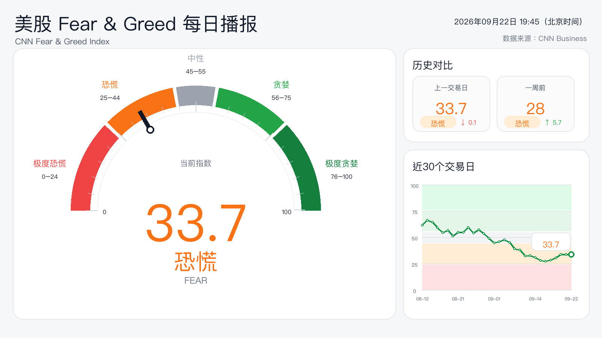

# Fear & Greed Tracker

**One quick read on market sentiment, delivered automatically.**

A Chinese visual briefing for me and my Discord group, designed for a quick check after the U.S. market closes.



*Real preview generated on 22 September 2026 from CNN data. This saved example is not a live or final closing reading.*

## What it shows

The current Fear & Greed score and zone, comparisons with the previous trading day and week, and the recent 30-trading-day trend. A short Chinese interpretation accompanies the card in Discord.

**Market sentiment data → visual card → short interpretation → Discord**

## Automatic delivery

GitHub Actions starts scheduled attempts about two hours after the U.S. close on weekdays, with fallback runs and snapshot-date deduplication. Runner delays can affect delivery time. No server or Discord Bot is required, just a webhook.

Add `DISCORD_WEBHOOK_URL` under repository **Settings → Secrets and variables → Actions**. To preview without posting, run **Daily Fear & Greed Broadcast** manually with `dry_run: true`.

## Run locally

```bash
python -m pip install -r requirements.txt
DRY_RUN=true python src/fear_greed_bot.py
```

Linux needs a Chinese font such as `fonts-noto-cjk`. Override fonts with `FONT_REGULAR` / `FONT_BOLD`, and the image path with `OUTPUT_IMAGE_PATH`. Scheduling lives in [the workflow](.github/workflows/daily-fear-greed.yml).

Checks: `python -m unittest discover -s tests -v`.

Source: CNN Fear & Greed Index. Sentiment context, not investment advice.
